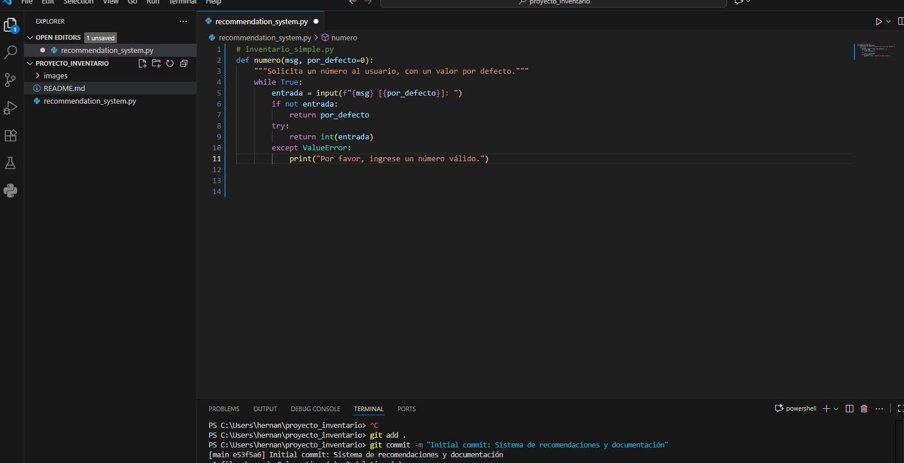

# proyecto_inventario

# Actividad: Uso de IA con GitHub Copilot — Evidencias del proceso

## 1) Introducción: ¿de qué trata el trabajo?
Este trabajo consiste en **utilizar la inteligencia artificial de GitHub Copilot** para asistir la creación de código y **documentar** el flujo completo del proyecto:
1) Crear el **repositorio en GitHub (web)** con README y visibilidad (público/privado).
2) **Clonar** el repositorio y abrirlo en **Visual Studio Code**.
3) Crear un archivo Python y **pedir/aceptar sugerencias** a **GitHub Copilot**, dejando evidencia.
4) Controlar versiones con **Git** (`git add` → `git commit`) y **publicar** en remoto con **`git push`**.

## 2) Creación del repositorio en GitHub

### 2.1 Ingreso a la página de GitHub
Ingresé al **sitio oficial de GitHub** desde el navegador para comenzar la actividad de uso de **IA con GitHub Copilot**.  
Esta captura muestra la pantalla de **inicio de sesión** (username/email y password), confirmando que accedí correctamente al portal.

**Captura:**  


### 2.2 Inicio de sesión con mi usuario
Ingresé con mi **cuenta de GitHub** y accedí al **dashboard (Home)**.  
Esta captura evidencia que la sesión quedó iniciada correctamente (se observa la barra lateral con repositorios, la caja “Ask Copilot” y el feed).

**Captura:**  


### 2.3 Creación de un nuevo repositorio
Abrí **New repository** y definí el **nombre del repositorio**: `proyecto_inventario`.  
En la captura se ve:
- **Owner:** mi cuenta (`hagp1986`).
- **Repository name:** `proyecto_inventario` con la confirmación verde de disponibilidad.
- (Opcional) se puede agregar una **descripción** corta del proyecto para que sea más fácil identificarlo.

**Buenas prácticas:**
- Usar nombres **cortos y descriptivos**.
- Evitar espacios y caracteres especiales (usar guiones `-` o guion_bajo `_`).

**Captura:**  


### 2.4 Activar la opción de crear README
Marqué la opción **“Add a README file”** para iniciar la documentación del repositorio desde el primer commit.  
El README servirá para explicar objetivos, pasos y evidencias (capturas) de la actividad con **GitHub Copilot**.

**Captura:**  


> Nota: En esta misma pantalla también aparecen opciones para **.gitignore** y **licencia**. Si el proyecto es de Python, luego puedo añadir `.gitignore (Python)` y opcionalmente una licencia (por ejemplo, MIT).

### 2.5 Elegir visibilidad: Privado
Configuré la **visibilidad del repositorio como _Private_** para que solo las personas autorizadas puedan ver el contenido.

**Captura:**  


**Buenas prácticas / recomendaciones:**
- Si el docente necesita acceder, **invitarlo como colaborador** o, si la pauta lo permite, cambiar a **Public** (Settings → General → *Change repository visibility*).
- Dejar registro en el README de la elección y el motivo (por ejemplo, protección de datos del curso).

### 2.6 Jumpstart your project with Copilot (opcional)
En la sección **“Jumpstart your project with Copilot (optional)”** aparece un cuadro para escribir un prompt.  
En esta actividad dejé el cuadro **vacío** (la guía principal es crear el repo con README y visibilidad). Más adelante usaré **GitHub Copilot** dentro de VS Code para generar código.

**Captura:**  


### 2.7 Crear el repositorio
Confirmé la configuración y presioné **Create repository** para finalizar la creación del repositorio con:
- **Nombre** definido previamente.
- **README** activado.
- **Visibilidad** configurada (Privado).

**Captura (botón Create repository):**  


## 3) Clonación del repositorio y apertura en Visual Studio Code

Cloné el repositorio remoto de GitHub en mi equipo usando la terminal y luego abrí la carpeta del proyecto en **VS Code**.

### 3.1 Clonar el repositorio
Ejecuté el comando `git clone` para descargar una copia local del repositorio desde GitHub a mi equipo.

**Comando utilizado:**
```bash
git clone https://github.com/hagp1986/proyecto_inventario.git
```

**Captura:**  


### 3.2 Abrir en Visual Studio Code
Abrí la carpeta del proyecto clonado en Visual Studio Code para comenzar el desarrollo.

**Comando utilizado:**
```bash
code proyecto_inventario
```

**Captura:**  


## 4) Creación del archivo y solicitud a GitHub Copilot

### 4.1 Crear `recommendation_system.py` en VS Code
Dentro del repositorio abierto en **Visual Studio Code**, creé el archivo **`recommendation_system.py`**.  
Este archivo será el punto de partida para **probar la IA de GitHub Copilot**: primero escribo un comentario que describa lo que quiero (por ejemplo: *“# Sistema de recomendación simple para inventario”*), y luego dejo que **Copilot sugiera código**. Acepto una sugerencia con **Tab**.

**Objetivo del paso:**
- Tener un archivo Python listo para que Copilot proponga el **código inicial**.
- Dejar evidencia de la creación del archivo dentro del proyecto.

**Buenas prácticas:**
- Nombrar archivos de forma **clara y descriptiva**.
- Guardar el archivo después de crear (evita el estado *unsaved*).
- Si Copilot no sugiere de inmediato, escribir un comentario o el nombre de una función para orientar la propuesta.

**Captura:**  


### 4.2 Sugerencia de código por GitHub Copilot
Dentro del archivo **`recommendation_system.py`**, escribí un comentario inicial para orientar a Copilot (ej.: `# inventario_simple.py`) y comencé a definir una función.  
**GitHub Copilot** sugirió automáticamente un bloque de código que implementa la función **`numero(msg, por_defecto=0)`** con validación de entradas:
- Pide un valor por teclado.
- Acepta **Enter** para usar un valor por defecto.
- Usa `try/except` para manejar errores y volver a pedir el dato si no es válido.
- Evita valores **negativos** cuando corresponde.

Esta función me servirá para **ingresar datos del inventario** de forma segura (por ejemplo, stock, entradas, salidas) antes de aplicar la lógica de cálculo/recomendación.

**Cómo acepté la sugerencia:** presioné **Tab** sobre la propuesta de Copilot y se insertó el bloque en el editor.

**Captura:**  


> Nota: Si Copilot no sugiere de inmediato, escribo el nombre de la función o un comentario que describa lo que quiero y espero la propuesta; también puedo invocarlo con el atajo de mi extensión de Copilot.

### 4.3 Aceptar la sugerencia de Copilot
Presioné **Tab** para **aceptar la sugerencia** de GitHub Copilot dentro de `recommendation_system.py`.  
La función propuesta (`numero(msg, por_defecto=0)`) quedó insertada en el archivo, incluyendo:
- Solicitud de entrada al usuario.
- Uso de **valor por defecto** si se presiona Enter.
- Conversión a entero y manejo de errores con `try/except`.

**Acción posterior recomendada:** Guardar el archivo (**Ctrl+S**) para confirmar los cambios.

**Captura:**  


## 5) Control de versiones con Git

### 5.1 Preparar cambios: `git add`
Ejecuté `git add` para **preparar (staging)** los archivos que modifiqué/creé — por ejemplo, `recommendation_system.py`, `README.md` y las imágenes — antes de guardarlos en el historial.

**Comando utilizado:**
```bash
git add .
```

**Captura:**  


### 5.2 Guardar cambios en el historial: `git commit`
Ejecuté `git commit -m "Initial commit: Sistema de recomendaciones y documentación"` para **guardar** en el historial local los archivos que había preparado con `git add`.

**Comando utilizado:**
```bash
git commit -m "Initial commit: Sistema de recomendaciones y documentación"
```

**Captura:**  


### 5.3 Conectar con el repositorio remoto
Para conectar el repositorio local con el repositorio remoto de GitHub, ejecuté el comando `git remote add origin` con la URL HTTPS del repositorio.

**Comando utilizado:**
```bash
git remote add origin https://github.com/hagp1986/proyecto_inventario.git
```

### 5.4 Subir cambios al repositorio remoto: `git push`
Ejecuté `git push` para **subir** todos los commits locales al repositorio remoto en GitHub, haciendo que el código sea visible en la web.

**Comando utilizado:**
```bash
git push -u origin main
```

Este comando:
- Sube la rama `main` al repositorio remoto
- La opción `-u` configura el tracking automático para futuros push

## 6) Verificación del repositorio en GitHub

Después del push, verifiqué que todos los archivos se subieron correctamente al repositorio de GitHub:
- ✅ `recommendation_system.py` - Código Python con sugerencias de Copilot
- ✅ `README.md` - Documentación completa del proceso
- ✅ `images/` - Carpeta con todas las capturas de pantalla

## Conclusión

Se completó con éxito el flujo solicitado por la actividad:

Repositorio creado en GitHub con README y visibilidad configurada.

Clonación y trabajo en VS Code.

Interacción con IA (Copilot): se obtuvo una sugerencia de código útil para el proyecto y se aceptó correctamente, quedando registrada en el archivo.

Control de versiones con Git y publicación en remoto mediante git push.


